# AWS Architecture Design for MyCandidate Application

## Architecture Overview

This design uses **Amazon ECS (Elastic Container Service)** for container orchestration, providing a fully managed solution that's easier to operate than EKS for this use case while maintaining scalability and cost-effectiveness.

## 1. Container Orchestration Strategy

### ECS vs EKS Decision
**Chosen: Amazon ECS**

**Rationale:**
- **Simpler Operations**: No Kubernetes cluster management overhead
- **Cost Effective**: No additional charges for the control plane
- **AWS Native**: Better integration with AWS services (ALB, CloudWatch, IAM)
- **Sufficient Complexity**: Application doesn't require Kubernetes-specific features
- **Faster Deployment**: Shorter learning curve and setup time

### ECS Configuration
- **Launch Type**: Fargate (serverless containers)
- **Service Auto Scaling**: Target tracking based on CPU/memory utilization
- **Task Definition**: Separate tasks for web app and API components
- **Load Balancing**: Application Load Balancer with target groups

## 2. Instance Sizing Recommendations

### Compute Resources

| Component | Instance Type | vCPU | Memory | Rationale |
|-----------|---------------|------|--------|-----------|
| **Web Application** | t3.medium | 2 | 4 GB | Frontend serving with moderate traffic |
| **API Service** | t3.small | 2 | 2 GB | Lightweight API processing |
| **Database** | db.t3.medium | 2 | 4 GB | PostgreSQL with moderate concurrent users |
| **Cache** | cache.t3.micro | 2 | 0.5 GB | Session storage and caching |

### Auto Scaling Configuration
- **Minimum Instances**: 2 (high availability)
- **Maximum Instances**: 10 (traffic spikes)
- **Target CPU Utilization**: 70%
- **Scale-up**: Add 1 instance when CPU > 70% for 2 minutes
- **Scale-down**: Remove 1 instance when CPU < 50% for 5 minutes

## 3. Secure Networking Design

### VPC Architecture
```
VPC CIDR: 10.0.0.0/16
├── Public Subnets (ALB, NAT Gateways)
│   ├── AZ-1a: 10.0.1.0/24
│   └── AZ-2b: 10.0.2.0/24
├── Private Subnets (ECS Tasks)
│   ├── AZ-1a: 10.0.10.0/24
│   └── AZ-2b: 10.0.20.0/24
└── Database Subnets (RDS)
    ├── AZ-1a: 10.0.30.0/24
    └── AZ-2b: 10.0.40.0/24
```

### Security Groups

**ALB Security Group**
- Inbound: HTTPS (443) from 0.0.0.0/0
- Inbound: HTTP (80) from 0.0.0.0/0 (redirect to HTTPS)
- Outbound: Port 8080 to ECS Security Group

**ECS Security Group**
- Inbound: Port 8080 from ALB Security Group
- Outbound: HTTPS (443) to 0.0.0.0/0 (for external APIs)
- Outbound: Port 5432 to RDS Security Group
- Outbound: Port 6379 to ElastiCache Security Group

**RDS Security Group**
- Inbound: Port 5432 from ECS Security Group only
- No outbound rules (default deny)

**ElastiCache Security Group**
- Inbound: Port 6379 from ECS Security Group only
- No outbound rules (default deny)

## 4. Load Balancing Strategy

### Application Load Balancer (ALB)
- **Multi-AZ Deployment**: Deployed across 2 availability zones
- **SSL Termination**: Handles HTTPS certificates (AWS Certificate Manager)
- **Health Checks**: HTTP health checks on `/health` endpoint
- **Sticky Sessions**: Disabled (stateless application design)
- **Target Groups**: 
  - Web App: Port 8080, HTTP health check
  - API: Port 5000, HTTP health check on `/api/health`

### CloudFront CDN
- **Static Asset Caching**: CSS, JS, images cached at edge locations
- **Dynamic Content**: API responses with short TTL (5 minutes)
- **Geographic Distribution**: Global edge locations
- **Security**: Origin Access Identity for S3 bucket access

## 5. Storage Solutions

### Amazon S3
- **Primary Bucket**: Static assets, application logs
- **Versioning**: Enabled for data protection
- **Encryption**: SSE-S3 encryption at rest
- **Cross-Region Replication**: Backup to us-west-2
- **Lifecycle Policies**: 
  - Logs: IA after 30 days, Glacier after 90 days
  - Static assets: IA after 60 days

### Amazon RDS PostgreSQL
- **Multi-AZ**: Primary in us-east-1a, standby in us-east-1b
- **Read Replica**: For read-heavy operations
- **Backup**: 7-day automated backups
- **Encryption**: KMS encryption at rest
- **Parameter Groups**: Optimized for application workload

### ElastiCache Redis
- **Cluster Mode**: Disabled (sufficient for current scale)
- **Multi-AZ**: Enabled with automatic failover
- **Backup**: Daily snapshots with 5-day retention
- **Use Cases**: Session storage, API response caching

## 6. Secrets Management

### AWS Secrets Manager
- **Database Credentials**: PostgreSQL connection strings
- **API Keys**: Third-party service credentials
- **Application Secrets**: JWT signing keys, encryption keys
- **Rotation**: Automatic rotation for database passwords (30 days)
- **Access Control**: IAM policies restrict access to specific ECS tasks

### Implementation
```json
{
  "database": {
    "host": "XXXXX.us-east-1.rds.amazonaws.com",
    "username": "XXXX",
    "password": "XXXX",
    "database": "XXXX"
  },
  "redis": {
    "endpoint": "XXXX.cache.amazonaws.com:6379",
    "password": "XXXX"
  }
}
```

## 7. Scaling Considerations

### Horizontal Scaling
- **ECS Service Scaling**: Based on CloudWatch metrics
- **Database Read Scaling**: Read replicas for query distribution
- **Cache Scaling**: ElastiCache cluster scaling for memory requirements

### Vertical Scaling
- **Progressive Instance Types**: t3.small → t3.medium → t3.large
- **Database Scaling**: db.t3.medium → db.m5.large → db.m5.xlarge
- **Memory Optimization**: Monitor memory utilization for container right-sizing

### Scaling Triggers
1. **CPU Utilization > 70%**: Scale up ECS services
2. **Memory Utilization > 80%**: Scale up ECS services  
3. **Database CPU > 80%**: Consider read replicas or instance upgrade
4. **Response Time > 2s**: Investigate bottlenecks and scale accordingly

## 8. Security Best Practices

### Network Security
- **WAF**: Protection against common web attacks (SQL injection, XSS)
- **Private Subnets**: All application components in private subnets
- **NAT Gateways**: Controlled outbound internet access
- **VPC Flow Logs**: Network traffic monitoring

### Identity and Access Management
- **IAM Roles**: Task-specific roles with least privilege access
- **No Hardcoded Credentials**: All secrets in AWS Secrets Manager
- **MFA**: Required for all AWS console access
- **Cross-Account Access**: Separate accounts for dev/staging/production

### Data Protection
- **Encryption in Transit**: TLS 1.2+ for all communications
- **Encryption at Rest**: KMS encryption for RDS, S3, EBS volumes
- **Backup Encryption**: All backups encrypted with KMS
- **Data Classification**: PII data identified and protected

### Monitoring and Compliance
- **CloudTrail**: All API calls logged and monitored
- **Config**: Compliance monitoring for security configurations
- **GuardDuty**: Threat detection and monitoring
- **Security Hub**: Centralized security findings

## 9. CI/CD Pipeline Design

### Pipeline Stages

```mermaid
graph LR
    A[Code Commit] --> B[CodeBuild]
    B --> C[Security Scan]
    C --> D[Unit Tests]
    D --> E[Build Image]
    E --> F[Push to ECR]
    F --> G[Deploy to Staging]
    G --> H[Integration Tests]
    H --> I[Manual Approval]
    I --> J[Blue/Green Deploy]
    J --> K[Health Checks]
    K --> L[Production Live]
```



### Implementation Details

**1. Source Stage (AWS CodeCommit)**
- Git-based repository with branch protection
- Feature branches for development
- Pull request reviews required

**2. Build Stage (AWS CodeBuild)**
```yaml
version: 0.2
phases:
  pre_build:
    commands:
      - echo Logging in to Amazon ECR...
      - aws ecr get-login-password --region $AWS_DEFAULT_REGION | docker login --username AWS --password-stdin $AWS_ACCOUNT_ID.dkr.ecr.$AWS_DEFAULT_REGION.amazonaws.com
  build:
    commands:
      - echo Build started on `date`
      - echo Building the Docker image...
      - docker build -t $IMAGE_REPO_NAME:$IMAGE_TAG .
      - docker tag $IMAGE_REPO_NAME:$IMAGE_TAG $AWS_ACCOUNT_ID.dkr.ecr.$AWS_DEFAULT_REGION.amazonaws.com/$IMAGE_REPO_NAME:$IMAGE_TAG
  post_build:
    commands:
      - echo Build completed on `date`
      - echo Pushing the Docker image...
      - docker push $AWS_ACCOUNT_ID.dkr.ecr.$AWS_DEFAULT_REGION.amazonaws.com/$IMAGE_REPO_NAME:$IMAGE_TAG
```

**3. Security and Testing**
- **SAST**: SonarQube integration for code quality
- **Container Scanning**: ECR vulnerability scanning
- **Unit Tests**: Jest for API, pytest for Python components
- **Integration Tests**: Postman/Newman for API testing

**4. Deployment Stage (AWS CodeDeploy)**
- **Blue/Green Deployment**: Zero-downtime deployments
- **Automatic Rollback**: Based on health check failures
- **Canary Releases**: 10% traffic to new version for 10 minutes

**5. Monitoring and Rollback**
- **CloudWatch Alarms**: Monitor error rates and latency
- **Automatic Rollback**: Triggered by alarm thresholds
- **Manual Controls**: Emergency rollback capabilities

### Pipeline Security
- **IAM Roles**: Least privilege for pipeline components
- **Artifact Encryption**: S3 bucket encryption for build artifacts
- **Secret Management**: No credentials in buildspec files
- **Approval Gates**: Manual approval for production deployments

## 10. Cost Optimization

### Estimated Monthly Costs (USD)

| Service | Configuration | Monthly Cost |
|---------|---------------|-------------|
| **ECS Fargate** | 2x t3.medium, 2x t3.small | $85 |
| **ALB** | Standard load balancer | $20 |
| **RDS PostgreSQL** | db.t3.medium Multi-AZ | $140 |
| **ElastiCache** | cache.t3.micro x2 | $25 |
| **S3** | 100GB storage, requests | $10 |
| **CloudFront** | 1TB transfer | $85 |
| **Secrets Manager** | 5 secrets | $10 |
| **NAT Gateways** | 2 gateways | $90 |
| **Data Transfer** | Inter-AZ, internet | $30 |
| **CloudWatch/Monitoring** | Logs, metrics, alarms | $15 |
| **Total Estimated** | | **~$510/month** |

### Cost Optimization Strategies
1. **Reserved Instances**: 40% savings on RDS with 1-year commitment
2. **Spot Instances**: Use for non-critical batch processing
3. **S3 Intelligent Tiering**: Automatic cost optimization for storage
4. **CloudWatch Logs Retention**: 30-day retention for application logs
5. **Resource Tagging**: Cost allocation and optimization insights

## 11. Disaster Recovery Plan

### Recovery Objectives
- **RTO (Recovery Time Objective)**: 4 hours
- **RPO (Recovery Point Objective)**: 1 hour

### Backup Strategy
- **Database**: Automated backups with 7-day retention
- **Application**: Container images in ECR with versioning
- **Configuration**: Infrastructure as Code (CloudFormation/Terraform)
- **Secrets**: Cross-region replication in Secrets Manager

### Failover Procedures
1. **Automated Failover**: RDS Multi-AZ automatic failover
2. **Regional Failover**: Manual deployment to us-west-2
3. **Data Recovery**: Point-in-time recovery from backups
4. **Testing**: Quarterly DR testing and documentation updates

This architecture provides a robust, secure, and scalable foundation for the MyCandidate while maintaining cost-effectiveness and operational simplicity.